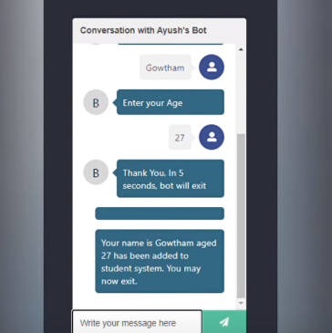

# AGE ADVISOR CHATBOT
👨‍💻É UM ASSISTENTE VIRTUAL DESENVOLVIDO UTILIZANDO REACT E REDUX, PROJETADO PARA INTERAGIR COM USUÁRIOS ATRAVÉS DE UM CHATBOT E FORNECER FUNCIONALIDADES BASEADAS NA SELEÇÃO DE IDADE.

 <br>

## DESCRIÇÃO:
O projeto "Age Advisor Chatbot" é um assistente virtual desenvolvido utilizando React e Redux, projetado para interagir com usuários através de um chatbot e fornecer funcionalidades baseadas na seleção de idade.

Este projeto utiliza React para a construção da interface de usuário e Redux para gerenciamento de estado, proporcionando uma experiência interativa e personalizada através de um chatbot que coleta informações do usuário e responde com base nas entradas fornecidas.

## FUNCIONALIDADES:
1. **Inicialização e Saudação:**
   - Quando iniciado, o bot saúda o usuário com a mensagem "Hello. Nice to meet you." através da função `handleHello`.

2. **Coleta de Informações:**
   - Após a saudação inicial, o bot solicita ao usuário que digite seu nome através da função `handleGot`, seguido pela mensagem "Enter Your Name".

3. **Seleção de Idade:**
   - O bot apresenta ao usuário um menu dropdown com opções de idade, permitindo ao usuário selecionar sua idade através do componente `AgeDropdown`.
   - Quando o usuário seleciona uma idade válida, a função `showAge` é acionada, exibindo a idade selecionada no chat.

4. **Confirmação e Encerramento:**
   - Após a seleção da idade, o bot agradece ao usuário e informa que em 5 segundos ele irá encerrar a interação.
   - Após o tempo especificado, a função `handleFinal` é chamada, marcando a página como finalizada através do Redux.

5. **Exibição de Imagem:**
   - Em resposta à solicitação do usuário, o bot pode enviar uma imagem de um cachorro utilizando a função `handleDog`, demonstrando a capacidade de integrar widgets e conteúdos multimídia.

## EXECUTANDO O PROJETO:   
1. **Instalando as Depêndencias:**
   - Para instalar as dependências listadas no arquivo "package.json", você pode usar o comando `npm install` no terminal. Certifique-se de estar no diretório do seu projeto onde o arquivo "package.json" está localizado (`CODIGO`). O npm irá ler o arquivo "package.json" e instalar todas as dependências listadas nele. 

   ```bash
   npm install
   ```

2. **Inicie o Bot:**
   - Inicie o bot com o seguinte comando:
    ```bash
    npm start
    ```

   - Acesse o BOT no navegador visitando [http://localhost:3000](http://localhost:3000/).

3. **Interagindo com o Bot:**
   1. **Iniciar a Conversa:**
      - O usuário inicia a interação com o bot, que responde com uma saudação inicial.

   2. **Responder às Solicitações:**
      - Siga as instruções do bot para fornecer seu nome e selecionar sua idade na lista suspensa fornecida pelo componente `AgeDropdown`.

   3. **Explorar Recomendações:**
      - Após selecionar sua idade, o bot pode sugerir informações adicionais ou recursos com base nas preferências configuradas.

   4. **Encerrar a Interatividade:**
      - Após a conclusão da interação, o bot informa que irá encerrar a conversa automaticamente após um curto período de tempo.

## NÃO SABE?
- Entendemos que para manipular arquivos em muitas linguagens e tecnologias relacionadas, é necessário possuir conhecimento nessas áreas. Para auxiliar nesse aprendizado, oferecemos cursos gratuitos disponíveis:
* [CURSO DE REACT CHATBOT KIT](https://github.com/VILHALVA/CURSO-DE-REACT-CHATBOT-KIT)
* [CURSO DE REACT](https://github.com/VILHALVA/CURSO-DE-REACT)
* [CURSO DE JAVASCRIPT](https://github.com/VILHALVA/CURSO-DE-JAVASCRIPT)
* [CURSO DE HTML E CSS](https://github.com/VILHALVA/CURSO-DE-HTML-E-CSS)
* [CURSO DE NODEJS](https://github.com/VILHALVA/CURSO-DE-NODEJS)
* [CONFIRA MAIS CURSOS](https://github.com/VILHALVA?tab=repositories&q=+topic:CURSO)

## CREDITOS:
- [PROJETO CRIADO PELO "ayushsgithub"](https://github.com/ayushsgithub/react_chatbot_kit)
- [PROJETO EDITADO PELO VILHALVA](https://github.com/VILHALVA)

